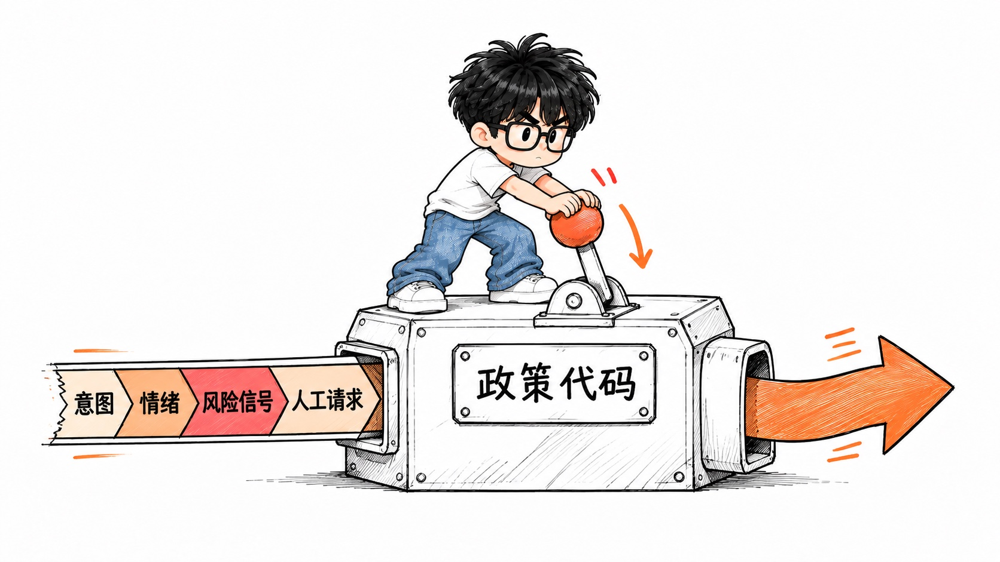
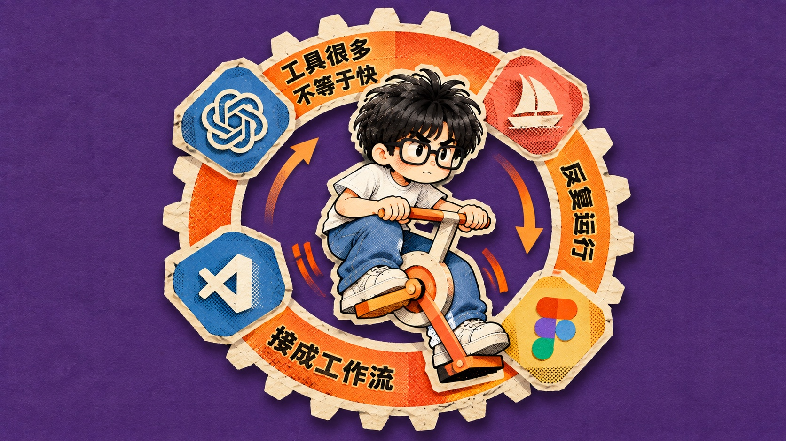
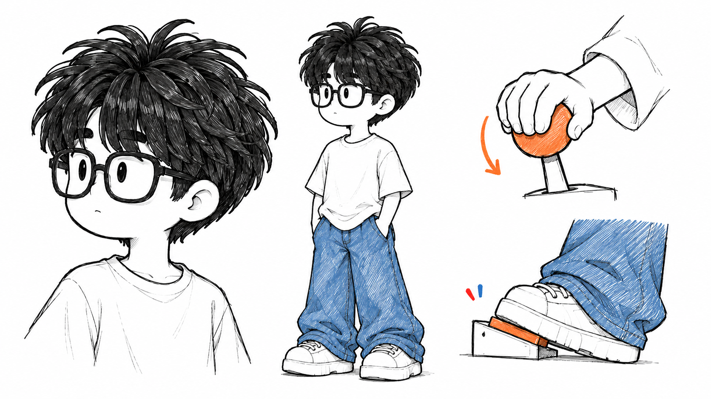
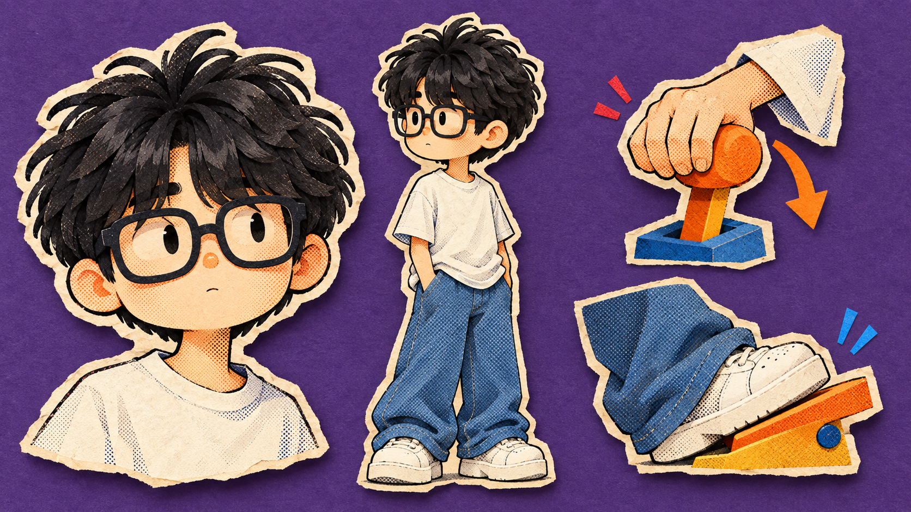
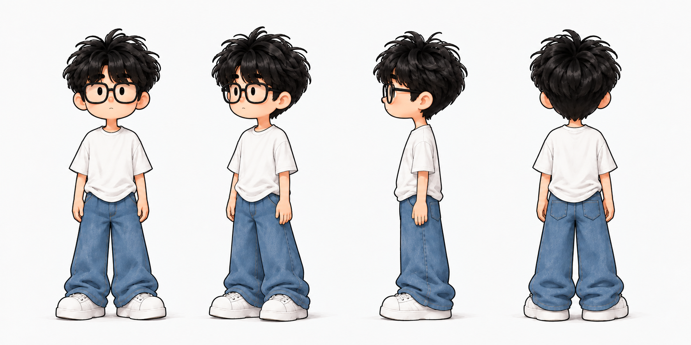

# Xinju IP 配图 Skill

把中文文章、短口播和观点句，转化为由迷你人物 IP 亲自参与的正文配图。



输入一段中文内容，Skill 会提炼其中最值得被看见的观点、流程、结构或隐喻，先给出配图方案，再按你选择的风格生成图片。新安装默认使用 Xinju，也可以换成你上传的真人照片或已有卡通 IP。

## 核心能力

- 为中文文章、短口播和单句观点设计正文配图。
- 自动提炼认知锚点，并为人物安排清楚的动作、物件和视觉隐喻。
- 支持手绘线稿、平涂插画、拼贴漫画三种风格。
- 默认使用 Xinju，也可将真人照片或已有 IP 设为活动人物。
- 默认生成 16:9 横版图片，也支持按要求原生构图其他画幅。

## 工作方式

```text
内容输入 → 提炼认知锚点 → 输出配图方案 → 选择最终风格 → 逐张生成并执行质量检查
```

风格编号固定为：

```text
1：手绘线稿
2：平涂插画
3：拼贴漫画
```

## 案例

### 1. 手绘线稿：客服决策工作流

**原文**

> 官方展示的客服工作流，会先判断用户意图、情绪、风险信号和是否要求人工，再由代码按照政策决定下一步动作。

**画面说明**

意图、情绪、风险信号和人工请求依次进入“政策代码”机器；Xinju 压下控制杆，由规则统一决定下一步动作。画面把客服系统中“模型负责判断、代码负责决策”的分工压缩成一条清晰路径。


### 2. 平涂插画：工作台的四个核心节点

**原文**

> 参考图是节点编辑器，工作台的核心是任务、日历、内容生产和数据监测。

**画面说明**

任务、日历、内容生产和数据监测围绕中央工作台连接成一个模块化系统；Xinju 正在接入最后一个节点。画面用清楚的主次和连线关系，快速说明产品由哪些核心能力组成。


### 3. 拼贴漫画：把工具接成工作流

**原文**

> AI 工具越多，工作未必越快；真正的效率，来自把它们接成一条能反复运行的工作流。

**画面说明**

多个独立工具分布在循环齿轮周围，Xinju 踩动中央装置，让它们从零散集合变成持续运转的工作流。画面强调：效率不取决于工具数量，而取决于是否形成稳定、可复用的连接。



## 使用方法

### 1. 直接生成正文配图

新安装默认使用 Xinju；如果已经替换过人物，则自动使用当前活动人物。

```text
使用 $xinju-ip-illustrations，为下面这段内容生成正文配图：

<粘贴文章、短口播或观点句>
```

Skill 会先输出配图方案和三种风格。确认方案后，回复风格编号即可生成：

```text
1：手绘线稿
2：平涂插画
3：拼贴漫画
```

例如：

```text
确认，选择 1。
```

### 2. 更换或恢复人物 IP

更换人物只更新活动人物，不会同时生成正文配图。替换完成后，再按照上面的方式发送内容即可。

#### 真人照片生成新 IP

上传一张清晰、完整且已获授权的真人照片，然后发送：

```text
使用 $xinju-ip-illustrations，用我上传的真人照片生成迷你人物 IP，并直接替换活动人物。
```

#### 使用已有的人物 IP

上传完整人物图或多视图，然后发送：

```text
使用 $xinju-ip-illustrations，把我上传的人物 IP 直接设为活动人物，不重新设计。
```

#### 查看当前人物

```text
使用 $xinju-ip-illustrations，展示当前活动人物。
```

#### 恢复默认 Xinju

```text
使用 $xinju-ip-illustrations，恢复 Xinju。
```

> Skill 同时只保留一个活动人物。新人物会直接覆盖当前人物；恢复 Xinju 后，后续配图重新使用内置 Xinju。

更多可复制的调用方式见 [`examples/prompts.md`](examples/prompts.md)。

## 三种风格怎么选

| 风格 | 更适合的内容 | 对应案例 |
| --- | --- | --- |
| 手绘线稿 | 方法论、工作流、产品观点 | 客服决策工作流 |
| 平涂插画 | 产品结构、系统关系、科技概念 | 工作台的四个核心节点 |
| 拼贴漫画 | 冲突、转折、情绪、抽象隐喻 | 把工具接成工作流 |

<details>
<summary>查看三种风格母板</summary>

### 手绘线稿

纯白背景、黑色手绘细线、浅暖肤色、少量身份色与红橙蓝批注。



### 平涂插画

单一主色场、几何平涂造型、克制的空间明暗与硬边投影。


### 拼贴漫画

有色纸面、半调纸偶、手工裁切质感与少量中文批注。



</details>

## 安装

### 在 Codex 中安装

```text
请从 https://github.com/X-leader/xinju-ip-illustrations
安装 xinju-ip-illustrations Skill。
```

### 手动安装

```bash
git clone https://github.com/X-leader/xinju-ip-illustrations.git
cd xinju-ip-illustrations
mkdir -p "${CODEX_HOME:-$HOME/.codex}/skills"
cp -R ./xinju-ip-illustrations "${CODEX_HOME:-$HOME/.codex}/skills/"
```

安装后可以用下面这句话检查：

```text
使用 $xinju-ip-illustrations，展示当前活动人物。
```

## 活动人物机制

- 新安装默认使用内置 Xinju。
- 同一时间只保留一个活动人物。
- 设置新人物会直接覆盖当前活动人物，不维护历史人物列表，也不提供回退上一人物。
- 发送“恢复 Xinju”可随时恢复内置默认人物。
- 重新安装或用仓库版本覆盖 Skill，也会恢复仓库自带的 Xinju。



如果正在使用自定义人物，更新前请自行备份：

```text
xinju-ip-illustrations/assets/ip/active-ip-four-view.png
xinju-ip-illustrations/references/character-ip.md
```

## 隐私

- 只上传本人或已经获得授权的人物照片与 IP 素材。
- 原始真人照片不会写入 Skill，也不会进入本仓库。
- 仓库只保留最终活动人物母板、人物档案和公开风格资产。
- 发布、分享或提交代码前，请检查活动人物是否已经恢复为 Xinju。

## 项目结构

```text
.
├── README.md
├── LICENSE
├── NOTICE.md
├── THIRD_PARTY_NOTICES.md
├── examples/
│   ├── images/
│   └── prompts.md
├── tools/
│   └── verify_release.py
└── xinju-ip-illustrations/
    ├── SKILL.md
    ├── agents/
    ├── assets/
    ├── references/
    └── scripts/
```

## 许可证

Skill 规则、脚本和普通文档采用 [MIT License](LICENSE)。Xinju 人物母板、角色形象和品牌资产不包含在 MIT 授权范围内，使用规则见 [`NOTICE.md`](NOTICE.md) 和 [`assets/ip/ASSET_LICENSE.md`](xinju-ip-illustrations/assets/ip/ASSET_LICENSE.md)。

## 致谢与来源

本项目的早期工作流设计、正文配图方法和部分规则组织方式基于或参考了 Ian 创建的 [Ian Xiaohei Illustrations](https://github.com/helloianneo/ian-xiaohei-illustrations) 与 [Ian Xiaohei Scenes](https://github.com/helloianneo/ian-xiaohei-scenes)。原项目采用 MIT License。

本项目已针对 Xinju 人物 IP、三种渲染风格、活动人物替换、构图控制、物件预算、中文方案确认与自动 QA 流程进行了修改和扩展。完整第三方声明见 [`THIRD_PARTY_NOTICES.md`](THIRD_PARTY_NOTICES.md)。
